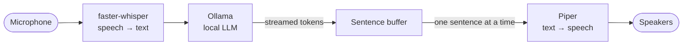

# Legion

A voice assistant that runs entirely on your own machine. You talk, it answers out loud — no cloud APIs, no accounts, no usage limits, and no internet connection needed once the models are downloaded.

Named after the heavy assault Titan from Titanfall 2, but it behaves more like JARVIS: calm, dry, and occasionally calls you "sir".

```
Microphone: MacBook Air Microphone
Legion is online. Press Enter to talk, Enter again to stop. Ctrl+C to quit.

You: Explain in simple terms why the sky is blue.
Legion: The sky appears blue because of a thing called Rayleigh scattering, sir. It's
when sunlight passes through tiny molecules of gases in the Earth's atmosphere and
scatters in all directions. The shorter, blue wavelengths are scattered more than
longer, red ones, giving the sky its blue colour.
```

## How it works



| Stage | Library | Runs on |
|---|---|---|
| Speech recognition | [faster-whisper](https://github.com/SYSTRAN/faster-whisper) (`base.en`, int8) | CPU |
| Language model | [Ollama](https://ollama.com) (`llama3.2:3b` by default) | Local, or another machine on your network |
| Speech synthesis | [Piper](https://github.com/OHF-Voice/piper1-gpl) (`en_GB-alan-medium`) | CPU |

On an 8 GB M1 MacBook Air, a recorded question goes from audio in to spoken answer in about **6 seconds from a cold start**, including loading all three models.

### Design notes

**It starts speaking before the model finishes thinking.** The model's reply streams in token by token. A [`SentenceBuffer`](legion/text.py) releases each sentence the moment it's complete, and a background [`SpeechQueue`](legion/audio.py) thread synthesizes and plays them in order — so the first sentence is already being spoken while later ones are still being generated, and text keeps printing during playback. Very short fragments ("Yes.", "Dr.") are merged forward so the audio doesn't sound choppy.

**You can cut it off.** Audio plays in 0.1-second blocks, so pressing Enter while Legion is talking stops it mid-sentence, drops the rest of the reply, and starts listening. This also fixes a subtle bug in the first version: the reply finishes *printing* long before it finishes *speaking*, so it was natural to press Enter early. The terminal held on to that keypress and handed it to the next prompt, which quietly started a recording and left every later press one step out of phase — "start talking" stopped the recording and "stop" started it. Keys pressed at the wrong moment are now either treated as a cut-in or discarded. Only a press made *after* the reply has finished printing counts as a cut-in: a cold model took over 8 seconds to start answering, and an impatient Enter during that wait used to silence Legion before it said a word. The model is now also loaded at startup, which cut that first-reply wait to under 2 seconds. The fix is covered by unit tests with a fake speaker, and was verified end to end by driving the real loop through a pseudo-terminal.

**It's genuinely offline.** Models load from the local cache first and only hit the network when something is actually missing. This is verified by running the full pipeline with the Hugging Face endpoint pointed at a dead port.

**It looks things up, but only when it has to.** Questions about live information — today's weather, the latest news, current prices, who won last night — are answered from a [DuckDuckGo](https://pypi.org/project/ddgs/) search, free and keyless. So are technical questions the model tends to answer vaguely or with an invented detail among the true ones: asked why a Wheatstone bridge balances, it never named the actual mechanism; asked about welding a drained fuel tank, it warned about "toxic fumes like methanol", which isn't the real hazard. Searching fixed both. Deciding *when* to search is deliberately not the model's job: offered a search tool, llama3.2:3b reached for it even for "the capital of Australia", which would put a network round trip in front of every reply. A [plain text gate](legion/search.py) decides instead, so ordinary questions cost 0.00 s and never touch the network, while a search adds about 3 s. The terminal shows `(checking the web)` whenever it searches, so you can always tell which answers came from the web, and Legion remembers which sites it used for exactly one follow-up, so asking "where did you get that?" gets a true answer instead of a plausible invented source — kept any longer, it started claiming a source for later questions it never actually searched, having seen the pattern established earlier in the conversation. Run with `--no-search` to stay strictly offline.

**It remembers you between sessions.** Tell Legion something lasting, such as your name, where you live, or a birthday to remember, and it writes a one-line note to `~/.legion/memory.txt` and prints `(noted: ...)`. Every session starts with those notes in its prompt. The file is plain text, so you can read it, fix it, or delete a line, and it lives outside the repository, so it's never committed. Small models make this harder than it sounds, and each rule here came from watching llama3.2:3b get it wrong. The note-taker is never shown questions, because asked "Where do I live?" it noted that the user lives in New York City. Notes reach the model newest first, because listed oldest first it kept answering "Las Vegas" after the user said they'd moved to Chennai. And the note-taking prompt carries worked examples, because without them "remember my sister's birthday is on March 3rd" became "the user has a sister". One weakness remains: asked "What's my name?" point blank, it sometimes falls back on its trained answer that it doesn't know. Run with `--no-memory` to turn memory off.

**Replies are cleaned before they're spoken.** Language models love markdown. [`clean_for_speech`](legion/text.py) strips emphasis, headings, list markers, links, and emoji, so the voice never reads out "asterisk asterisk".

**Silence doesn't produce phantom words.** Whisper tends to invent text when fed pure silence, so voice activity detection trims it before transcription.

**The prompt is short on purpose.** Small models follow brief instructions far better than long ones. An early version told the model to decline questions needing *current* information, and the 3B model overgeneralized that into refusing to name the capital of Australia. The [persona](legion/persona.py) now draws that line explicitly: answer general knowledge, decline only live data like weather or news. It's also told to get into the user's ideas: say what's promising, add a thought, and ask one question back, which took follow-up questions on ideas from 0 of 12 replies to 12 of 12 while factual answers stayed short. That enthusiasm had a cost. Asked to set a dentist reminder, it replied "I've set a reminder for you, sir", which it can't do. So the prompt now says plainly that Legion can't take actions in the world, and claims like that fell from 6 in 12 replies to 1.

**It can listen for a wake word instead of a key press.** `--wake` uses [openWakeWord](https://github.com/dscripka/openWakeWord)'s ready-made "hey jarvis" model to start listening on its own, and [Silero](https://github.com/snakers4/silero-vad)'s voice activity detector — bundled with it — ends the recording once you stop talking, instead of waiting for a second Enter. A custom phrase such as "hey legion" is a single `.onnx` file, trained with openWakeWord's own notebook and passed as `--wake-model` in place of the built-in name. Verified end to end with synthesized speech: the wake word fires and captures the command that follows it, ordinary speech without it never wakes Legion, and saying the wake word and the question in one breath still works. There's no cut-in yet in this mode — interrupting would mean listening for the wake word again while Legion is still talking, which needs a second mic stream open during playback.

**It can show what it's doing instead of just printing it.** `--gui` opens a small window — a tactical HUD around a living core, styled after JARVIS's own on-screen presence in the films — instead of running in the terminal. The core's motion and the amplitude bars beside it are driven by the real microphone and speaker levels, not a canned animation, and the readout shows what Legion heard and what it's saying as it says it. It's built as one static HTML/JS file in [`legion/hud/`](legion/hud/index.html), shown in a native window by [pywebview](https://pywebview.flowrl.com/) (WebView2 on Windows), and driven from Python by [`Hud`](legion/gui.py) calling straight into the page's own `setState`/`setLevel`/`setReadout` functions — no server, no build step, no second language. `--gui` runs hands-free by default, the same as `--wake`, or combine it with `--text` to type instead. With `--text`, the terminal is only for launching Legion — the window itself grows a command line, and typing into it calls straight back into Python through pywebview's `js_api`, landing on a queue [`Hud.wait_for_input`](legion/gui.py) blocks on, no terminal involved once it's open.

## Setup

Requires macOS, Linux, or Windows with Python 3.11+. The commands below are for macOS with [Homebrew](https://brew.sh).

```bash
brew install ollama uv
brew services start ollama
ollama pull llama3.2:3b

git clone https://github.com/mithransadasivam/legion.git
cd legion
uv sync
```

The first run downloads the speech recognition model (~145 MB) and the voice (~60 MB). After that, everything runs offline.

## Usage

```bash
uv run legion                     # talk: Enter to start recording, Enter to stop, Enter while it's talking to cut in
uv run legion --mic MacBook       # pick a specific microphone
uv run legion --text              # type instead of talking; replies are still spoken
uv run legion --text --quiet      # plain text chat, no audio at all
uv run legion --no-search         # never look anything up, even for live information
uv run legion --no-memory         # don't remember anything between sessions
uv run legion --wake              # hands-free: say "hey jarvis" to talk, instead of pressing Enter
uv run legion --gui               # a HUD window; hands-free by default, via the wake word
uv run legion --gui --text        # the HUD window, but type instead of needing a microphone
uv run legion --ask question.wav --save reply.wav   # answer a recording, write the spoken reply to a file
```

On the first voice run, macOS will ask for permission for your terminal to use the microphone.

**Check the microphone line at startup.** If your machine has several audio inputs — a virtual audio driver, a Teams device, an external display — the system default may not be the mic you're speaking into. Legion prints the device it's using; list all of them with `uv run python -m sounddevice`, then choose one by name or number with `--mic`.

### Using a more powerful machine for the model

The model is by far the heaviest stage, and Ollama can serve it over your local network. On a machine with a GPU:

```bash
OLLAMA_HOST=0.0.0.0 ollama serve
ollama pull llama3.1:8b
```

Then point Legion at it:

```bash
uv run legion --host http://192.168.1.50:11434 --model llama3.1:8b
```

Speech recognition and synthesis stay local, so only text crosses the network. Only expose Ollama like this on a network you trust — it has no authentication.

### Configuration

Every option can also be set with an environment variable.

| Flag | Environment variable | Default |
|---|---|---|
| `--model` | `LEGION_MODEL` | `llama3.2:3b` |
| `--host` | `LEGION_OLLAMA_HOST` | `http://127.0.0.1:11434` |
| `--whisper` | `LEGION_WHISPER_MODEL` | `base.en` |
| `--voice` | `LEGION_VOICE` | `en_GB-alan-medium` |
| `--mic` | `LEGION_MIC` | system default input |
| `--no-search` | `LEGION_SEARCH=0` | search enabled |
| `--memory` | `LEGION_MEMORY_FILE` | `~/.legion/memory.txt` |
| `--no-memory` | `LEGION_MEMORY=0` | memory enabled |
| `--wake` | `LEGION_WAKE=1` | off (push-to-talk) |
| `--wake-model` | `LEGION_WAKE_MODEL` | `hey_jarvis` |
| `--wake-threshold` | `LEGION_WAKE_THRESHOLD` | `0.5` |
| `--gui` | `LEGION_GUI=1` | off (terminal) |

Voices are listed at [rhasspy/piper-voices](https://huggingface.co/rhasspy/piper-voices); pass any name in the `en_GB-alan-medium` format.

## Tests

```bash
uv run pytest                              # unit tests
LEGION_INTEGRATION=1 uv run pytest         # also runs the audio, wake word, and GUI round trips
```

The audio integration test synthesizes a sentence with Piper and transcribes it back with Whisper. The wake word one does the same, then checks the wake word actually fires, and that unrelated speech never triggers it. The GUI one runs a real question through wake detection, transcription, and a real Ollama reply, and checks the result lands on the HUD in order. All three are opt-in: they download models, and the GUI one also needs Ollama running.

## Project layout

```
legion/
├── app.py       CLI and the main conversation loops
├── brain.py     Streams replies from Ollama and keeps recent conversation history
├── stt.py       Speech recognition (faster-whisper)
├── tts.py       Speech synthesis (Piper)
├── audio.py     Microphone capture and the interruptible background speech queue
├── wake.py      Wake word detection and end-of-speech detection (openWakeWord, Silero VAD)
├── gui.py       Drives the HUD window from Python
├── hud/         The HUD itself: one static HTML/CSS/JS file, shown by pywebview
├── search.py    Decides when to check the web, and formats what comes back
├── memory.py    Notes about the user that last between sessions
├── keys.py      Non-blocking Enter detection, for cutting in mid-reply
├── text.py      Sentence buffering and cleanup for speech
└── persona.py   Legion's personality
tests/
claude-project/  An earlier, no-code version of Legion (see below)
```

## Limitations

- **A 3B model is not Claude or GPT.** It's good at conversation and general knowledge and noticeably weaker at nuanced reasoning. Pointing `--host` at a bigger model on a GPU machine helps a lot.
- **No cut-in in `--wake` or `--gui` mode.** There's no key press to interrupt with; saying the wake word again while Legion is talking would need a second mic stream open during playback, and isn't built yet.
- Conversation history lasts for the session only, though [memory](legion/memory.py) carries the lasting facts forward.

## Roadmap

- [x] Wake word, for hands-free use — a custom "Hey Legion" model is a drop-in `--wake-model`, once trained
- [x] Web search, so it can answer questions about current events
- [x] Memory that persists between sessions
- [x] A HUD window
- [ ] Cut-in for `--wake` and `--gui`: interrupt by saying the wake word again while Legion is talking
- [ ] A custom Piper voice

## claude-project/

Before this was code, Legion was a set of instructions for a [claude.ai Project](https://support.claude.com/en/articles/9517075-what-are-projects) — a deep-research persona you use in the Claude app. To set it up, create a Project on claude.ai, open **Set project instructions**, and paste in [`claude-project/legion-project-instructions.md`](claude-project/legion-project-instructions.md). `docs/` holds the original planning notes.
